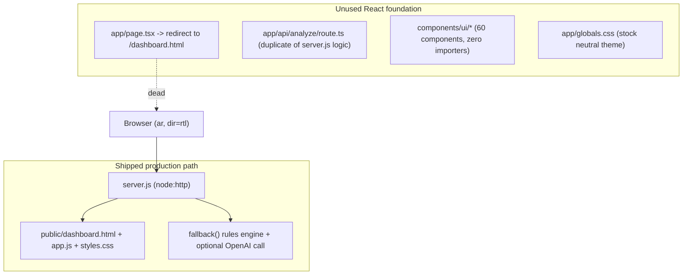
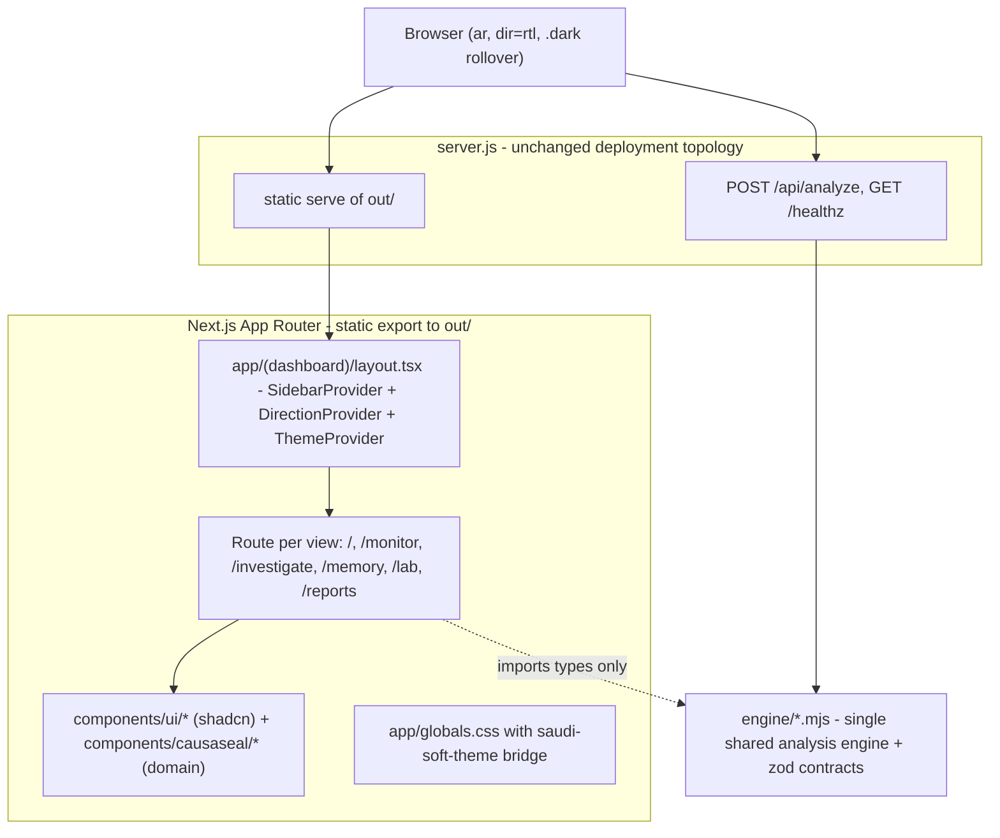

# CAUSASEAL — Design System & Architecture Audit

**Project:** CAUSASEAL + SERMG™ (SAIF 2026 Hackathon)
**Audit date:** 2026-09-21
**Target design system:** Saudi Soft (upstream shadcn/ui + Soft identity)
**Companion document:** [مطابقة-الفكرة-مع-الكود.md](./مطابقة-الفكرة-مع-الكود.md) — feature-level idea/code gap analysis

---

## 1. Executive Summary

The repository contains **two disconnected front-ends**:

1. **The shipped product** — a hand-written static page (`public/dashboard.html` + `public/app.js` + `public/styles.css`) with six in-page views, served by a plain Node HTTP server (`server.js`). This is what users see.
2. **An unused React foundation** — a Next.js 16 App Router skeleton with ~60 shadcn/ui components already vendored into `components/ui/`, which nothing imports. `app/page.tsx` simply redirects to the static HTML.

The static page is a competent visual prototype, but it is **architecturally incompatible with Saudi Soft**: it has zero design tokens, 59 hardcoded hex colors, an ad-hoc radius scale, text-glyph icons instead of Lucide, a second font family outside the Soft identity, and a bespoke dark mode toggled on `body`. None of it can be reused as-is.

The React foundation is much closer to Soft, but is not yet Soft-compliant: `components.json` declares the wrong icon library and RTL is disabled, and `app/globals.css` still carries the stock neutral/black shadcn theme with no Saudi green.

**Recommendation:** keep the working deployment topology (`server.js` for the API and static serving) and **replace the static UI with the React/shadcn app compiled to a static export**. This retains the only proven production path while unlocking the full component library for the 70% of the product that is still unbuilt.

---

## 2. Technology & Language Inventory

### Languages present

| Language | Where | Lines / size | Role |
| --- | --- | --- | --- |
| HTML | `public/dashboard.html`, `public/index.html` | 138 + 13 lines | Shipped UI markup, all six views inlined |
| CSS (plain, minified) | `public/styles.css` | 4 lines / 21 KB | All shipped UI styling — no preprocessor, no tokens |
| JavaScript (ES2020, no framework) | `public/app.js` | 32 lines / 10 KB, minified | View switching, fetch, localStorage, DOM string templating |
| JavaScript (Node ESM) | `server.js`, `scripts/*.mjs` | ~276 lines | Production HTTP server, analysis engine, Hostinger build |
| TypeScript / TSX | `app/`, `components/`, `lib/`, `hooks/`, `db/` | ~60 component files | Unused React foundation |
| CSS (Tailwind v4) | `app/globals.css`, `vendor/shadcn-tailwind-4.13.0.css` | 137 lines + vendor | Unused theme layer |
| Bash | `scripts/*.sh` | 3 files | Managed-Linux build wrappers |
| Markdown | `README.md`, `docs/` | — | Documentation |

### Dependency stack

- **Framework:** Next.js `16.3.4` (App Router, RSC enabled) + `vinext 1.0.0-beta.5` (Next-on-Vite dev runner) + `@cloudflare/vite-plugin` (Miniflare bindings)
- **UI:** `radix-ui` (unified package), `@base-ui/react` (used only by `combobox`), `lucide-react ^1.31.0`, `class-variance-authority`, `tailwind-merge`, `clsx`
- **Styling:** `tailwindcss 4.2.1` + `@tailwindcss/postcss`, `tw-animate-css`
- **Data/viz:** `recharts ^3.8.0`, `drizzle-orm` + `drizzle-kit` (schema is empty), `zod ^3.25.76`
- **Forms:** `react-hook-form`, `@hookform/resolvers`
- **Theming:** `next-themes ^0.4.6` (installed, never mounted)
- **Runtime:** Node.js >= 20, npm with `legacy-peer-deps=true`

### Notable dead weight

- `@shadcn/react ^0.3.0` — declared but effectively unused
- `db/schema.ts` — intentionally empty, `db/index.ts` requires a Cloudflare D1 binding that Hostinger does not provide
- `examples/d1/`, `.wrangler/`, `cloudflare-env.d.ts` — Cloudflare scaffolding irrelevant to the Hostinger target
- `dist/`, `.next/` — stale artifacts from the abandoned Next standalone deploy (commit `fa4b6da`, reverted by `4920e2c` after a 503)

---

## 3. Current Architecture

### Observed problems

- **Duplicated analysis engine.** `server.js` lines 55–167 and `app/api/analyze/route.ts` implement the same `fallback()` rules plus the same OpenAI Responses call, in two languages, with no shared source. They will drift.
- **No client-side routing.** All six views live in one HTML file and are toggled by `classList.toggle('active')`; there is no URL per view, so no deep linking, no browser history, and no per-view code splitting.
- **DOM string templating.** `app.js` builds rows via `innerHTML` with interpolated data. Any future real (non-hardcoded) event feed would be an XSS vector.
- **No state layer.** Fingerprints live in `localStorage` under `causaseal_fingerprints`; events are a frozen array literal.
- **Build is a copy.** `npm run build` runs `scripts/hostinger-build.mjs`, which only verifies and copies `public/` — nothing is compiled.

---

## 4. Target Architecture

Key properties:

- One UI codebase, one design system, one set of tokens.
- One analysis engine (`engine/`), imported by `server.js` at runtime and by the React app for **types only**.
- Deployment contract with Hostinger is unchanged: Express-style framework, entry `server.js`, `PORT` from env, `/healthz` intact.

---

## 5. Gap Analysis — Saudi Soft Design System

Skill evaluator result: **`MODE=B`, score 10/13** — shadcn is present, Soft theme bridge is absent.

### 5.1 Configuration (`components.json`)

| Field | Current | Soft requirement | Impact |
| --- | --- | --- | --- |
| `iconLibrary` | `"radix"` (reported by `shadcn info`; absent from the file) | `"lucide"` | Every future `shadcn add` emits Radix icons, violating the Soft icons rule |
| `rtl` | `false` | `true` | CLI emits physical `ml`/`mr` instead of logical `ms`/`me` |
| `base` | `"radix"` | `"radix"` — correct | Toasts must use `sonner`, not the Base UI `toast` |
| `style` | `"new-york"` | acceptable | — |
| `tailwind.baseColor` | `"neutral"` | superseded by the Soft bridge | — |
| `tailwind.css` | `app/globals.css` | correct — this is the only file the bridge may touch | — |
| `registries` | `{}` in file, `@shadcn` resolved by default | keep `@shadcn` only | No `@dga` registry under Soft |

Already correct: the 60 vendored components all import from `lucide-react` and the unified `radix-ui` package, so **no component rewrite is needed for icons** — only the config metadata is wrong.

### 5.2 Color tokens

| Concern | Current — `app/globals.css` | Current — `public/styles.css` | Soft target |
| --- | --- | --- | --- |
| Primary | `#171717` (near-black) | `#006c35` (Saudi flag green, hardcoded) | `#1B8354` (SA-600) via `--primary` |
| Primary hover / active | none | none | `#166A45` / `#14573A` |
| Background | `#ffffff` | `#fff` literals (15 occurrences) | `#FCFCFD` (gray-25) |
| Foreground | `#171717` | mixed literals | `#0D121C` (gray-950) |
| Border | `#e5e5e5` | mixed literals | `#E5E7EB` (gray-200) |
| Charts 1–5 | orange/teal/purple mix | n/a | SA-derived: `#1B8354 #54C08A #14573A #88D8AD #25935F` |
| Sidebar tokens | stock neutral, dark variant uses `#8e51ff` purple | n/a — bespoke `.sidebar` CSS | Soft `--sidebar-*` with SA-50 active fill |
| Status colors | `--destructive` only | 59 unique hardcoded hex values, no variables | `--success #079455`, `--warning #DC6803`, `--info #1570EF`, `--destructive #D92D20`, plus `--status-*-bg/border` pairs |
| Dark mode mechanism | `@media (prefers-color-scheme: dark)` — **not class-based** | `body.dark` toggled by `app.js` + `localStorage` | `.dark` class on the root element, driven by `next-themes` |

The `@media (prefers-color-scheme: dark)` block in `app/globals.css` is a hard blocker: Soft and shadcn both require the class-based `.dark` strategy so the user can override the OS preference. The Soft bridge supplies `@custom-variant dark (&:is(.dark *))`.

### 5.3 Typography

| Concern | Current | Soft target |
| --- | --- | --- |
| `--font-sans` (React) | `Arial, Helvetica, sans-serif` | `"IBM Plex Sans Arabic", "Work Sans", ui-sans-serif, system-ui` via `--font-sans-soft` |
| Body font (static UI) | `"IBM Plex Sans Arabic", Tahoma, sans-serif` | correct family, but loaded from the Google Fonts CDN at runtime |
| Display font (static UI) | `"Reem Kufi"` on headings | **not part of Soft** — remove; Soft uses IBM Plex Sans Arabic 400–700 only |
| Loading strategy | two `<link>` tags to `fonts.googleapis.com` | self-hosted via `next/font/google` (`IBM_Plex_Sans_Arabic`, weights 400/500/600/700) — no render-blocking third-party request |
| Mono | stock `ui-monospace` stack | `--font-mono-soft` with Inconsolata (optional) |

### 5.4 Radius

| Current | Soft ladder |
| --- | --- |
| `app/globals.css`: `--radius: 0.625rem` (10px) as the base | `--radius: 0.75rem` (12px) as the base |
| `public/styles.css`: 13 distinct values — 3, 4, 5, 6, 7, 8, 9, 10, 11, 12, 13, 20px and `50%` | three tokens only: `rounded-sm` 8px (chips), `rounded-md` 10px (buttons, inputs), `rounded-lg`/`xl` 12px (cards, dialogs), `rounded-full` for pills |

### 5.5 Icons

The static UI uses **Unicode text glyphs** as icons: `⌂` overview, `◉` monitor, `⌘` investigate, `◇` memory, `⚗` lab, `▤` reports, `☰` menu, `◐` theme toggle, `⌁` empty state, `✓ ! ?` status markers. These are not icons — they render inconsistently across platforms, cannot be sized or coloured reliably, and are invisible to assistive technology.

Soft mandates `lucide-react` components with `data-icon="inline-start" | "inline-end"` inside Buttons and no sizing classes on icons nested in components.

Proposed mapping:

- `⌂` → `LayoutDashboard`
- `◉` → `Radio` (or `Activity`)
- `⌘` → `GitBranch` (causal path) or `Search`
- `◇` → `Fingerprint`
- `⚗` → `FlaskConical`
- `▤` → `FileBarChart`
- `☰` → handled by `SidebarTrigger` (`PanelLeftIcon`, built in)
- `◐` → `Sun` / `Moon` via `next-themes`
- `⌁` → `ScanSearch` inside an `Empty` component
- `✓ ! ?` → `ShieldCheck`, `ShieldAlert`, `ShieldQuestion`

### 5.6 RTL

| Concern | Current | Soft target |
| --- | --- | --- |
| Document direction | `<html lang="ar" dir="rtl">` — correct in both `app/layout.tsx` and `dashboard.html` | keep |
| Radix direction context | none | wrap the app in `DirectionProvider` (`components/ui/direction.tsx` is already vendored) |
| Spacing utilities | n/a (static CSS uses physical properties) | logical only: `ms`/`me`/`ps`/`pe`/`start`/`end` |
| Directional icons | n/a | `rtl:rotate-180` on chevrons and arrows that encode direction |
| CLI output | `rtl: false` → physical properties in new components | `rtl: true` |

### 5.7 Dark mode

| Concern | Current | Soft target |
| --- | --- | --- |
| Trigger | `body.dark` class set by inline JS | `.dark` on `<html>` via `next-themes` `ThemeProvider attribute="class" defaultTheme="system" enableSystem` |
| Persistence | manual `localStorage.causaseal_dark` | handled by `next-themes` |
| Token strategy | six ad-hoc `.dark .selector` overrides in `styles.css` | full `.dark` block in the Soft bridge — SA lift + gray inversion; **no per-utility `dark:bg-*` brand overrides** |
| Flash of wrong theme | present | `suppressHydrationWarning` on `<html>` + `next-themes` inline script |

---

## 6. Gap Analysis — Component Layer

Every widget in the static UI must be replaced by a composed shadcn component. Nothing is reused verbatim.

### 6.1 Application shell

| Current | Replacement |
| --- | --- |
| `<aside class="sidebar">` with `.nav-item` buttons and a mobile `.open` class | `Sidebar` + `SidebarProvider` + `SidebarMenu`/`SidebarMenuButton` + `SidebarMenuBadge` for the memory count + `SidebarRail`; scaffold from `@shadcn/sidebar-07` (collapses to icons) |
| `.topbar` with `.menu-btn`, `.breadcrumb`, `.environment`, `.avatar` | `SidebarInset` header + `SidebarTrigger` + `Breadcrumb` + `Badge` for the environment chip + `Avatar` with a mandatory `AvatarFallback`; sticky-header pattern from `@shadcn/sidebar-16` |
| `.toast` div + `toast()` function | `sonner` (`components/ui/sonner.tsx` already vendored — correct choice because `base` is `radix`) |
| `.live-dot`, `.pulse` | `Badge` + a small animated dot using `tw-animate-css` |
| `.saif-badge` | `Badge variant="outline"` (meta chip; not Button SA-700) |
| View switching via `classList` | real routes under `app/(dashboard)/` with `next/link` and `usePathname()` for the active state |

### 6.2 Per-view mapping

**Overview (`#overview`)**
- `.metric-card` x4 → `Card` with `CardHeader`/`CardDescription`/`CardTitle`/`CardFooter`, plus `Badge` for the trend delta
- `.mini-bars` → `ChartContainer` + Recharts `BarChart` using `--chart-1..5`
- `.ring` conic-gradient → Recharts `RadialBarChart`
- `.confidence` / `.latency-line` → `Progress`
- `.event-list` → `Item` / `ItemGroup` composition, or `Card` + `Separator`
- `.risk-score` SVG gauge → Recharts `RadialBarChart` with `startAngle`/`endAngle`
- `.causal-flow` flow nodes + connectors → a dedicated `components/causaseal/causal-path.tsx` built from `Card` + `Separator` + Lucide `ChevronLeft` with `rtl:rotate-180`
- `.status-chip` → `Badge` variants
- `.decision-strip` → `ButtonGroup` + `Badge`

**Live Monitoring (`#monitor`)**
- `.filter-row` buttons → `ToggleGroup` (4 options — within the 2–7 range the Soft forms rule prescribes)
- `.search-box` → `InputGroup` + `InputGroupInput` + `InputGroupAddon` holding a Lucide `Search`
- `.events-table` div grid → `Table` with `TableHeader`/`TableBody`/`TableRow`/`TableCell`; optionally the TanStack-powered data table from `@shadcn/dashboard-01` if sorting and pagination are wanted
- `.decision` pills → `Badge` with semantic variants
- Empty filter result → `Empty`
- Loading → `Skeleton`

**Causal Analysis (`#investigate`)** — *the only view with real backend logic; preserve behaviour exactly*
- `<label><textarea>` pairs → `FieldGroup` + `Field` + `FieldLabel` + `Textarea` + `FieldDescription`
- `<select>` → `Select` with `SelectGroup`/`SelectItem`
- `.policy-checks` → `FieldSet` + `FieldLegend` + `Checkbox` inside `Field`
- Validation → `data-invalid` on `Field`, `aria-invalid` on the control, wired through `react-hook-form` + `zod`
- `#analyzeBtn` with manual `disabled` + text swap → `Button` composing `Spinner` + `data-icon="inline-start"` + `disabled` (**`Button` has no `isPending` prop**)
- `.empty-state` → `Empty` + `EmptyMedia`/`EmptyTitle`/`EmptyDescription`
- `.analysis-status` → `Alert` with a decision-driven variant
- `.graph-area` nodes → the shared `causal-path.tsx` component
- `.evidence-grid` → `Card` + `Separator`
- `.output-actions` → `ButtonGroup`

**X-CFS Memory (`#memory`)**
- `.memory-card` → `Card` + `CardHeader`/`CardContent`/`CardFooter`
- `.invariants` tag spans → `Badge variant="secondary"` (muted Soft chip, not SA-700)
- Empty library → `Empty`
- Detail view → `Sheet` (RTL-aware `side="start"`)

**SERMG Lab (`#lab`)**
- `<input type="range">` → `Slider`
- Mutation-type checkboxes → `FieldSet` + `FieldLegend` + `Checkbox`, or `ToggleGroup` if made exclusive
- `#runLab` `setInterval` animation → `Progress` + streamed rows; each row an `Item` with a `Badge`
- `.lab-score` → `Card` + `Progress`

**Reports (`#reports`)**
- `.experiment` cards → `Card` + `Badge`
- `.bar-metrics` → `Progress` or a Recharts horizontal `BarChart`
- `.decision-log` → `Table` or `ItemGroup`
- `.disclaimer` → `Alert variant="default"` with a Lucide `Info`
- Report download → `Button` + `Spinner`, and the report body moved server-side later

### 6.3 Soft critical-rule violations to avoid during the rebuild

From the skill's Critical Rules — these are the ones the current code would violate if ported naively:

- No `space-x-*` / `space-y-*` — use `flex` + `gap-*`
- No raw palette classes (`text-emerald-600`, `bg-green-600`) — semantic tokens only
- No manual `dark:` colour overrides — Soft tokens roll over
- No manual `z-index` on overlays
- `className` is for layout only, never to override a component's colours or typography
- `size-*` when width equals height
- `Dialog`/`Sheet`/`Drawer` always need a `Title` (use `sr-only` if visually hidden)
- `Avatar` always needs `AvatarFallback`
- `TabsTrigger` must live inside `TabsList`; `SelectItem` inside `SelectGroup`
- Use `cn()` for conditional classes

---

## 7. Gap Analysis — Runtime, Build & Deployment

| Concern | Current | Target |
| --- | --- | --- |
| Dev command | `node scripts/run-framework.mjs dev` → `vinext` (Vite) or raw Vite on managed Linux | `next dev` for the UI plus `node server.js` for the API, with a dev-only rewrite proxying `/api/*` |
| Build command | `scripts/hostinger-build.mjs` — copies `public/` to `.hostinger-static`, compiles nothing | `next build` with `output: "export"` → `out/`, then verification |
| Static root | `public/` (contains both assets and the app) | `out/` (build output); `public/` reduced to true static assets only |
| API | duplicated in `server.js` and `app/api/analyze/route.ts` | single `engine/` module imported by `server.js`; the App Router route handler is **deleted** (route handlers are incompatible with `output: "export"`) |
| Routing | one HTML file, `classList` toggling | file-system routes; `server.js` must resolve `/monitor` to `out/monitor.html` or `out/monitor/index.html` |
| Cloudflare/vinext layer | `vite.config.ts` wires `vinext` + `@cloudflare/vite-plugin` + Miniflare D1/R2 | not used by the Hostinger target; leave in place but stop depending on it, or remove in a later cleanup |
| Stale artifacts | `dist/`, `.next/`, `.wrangler/` committed or lingering | ensure `.gitignore` covers `out/`, `dist/`, `.next/`, `.wrangler/`, `.hostinger-static/` |
| Hostinger contract | Express framework, entry `server.js`, empty output directory, `PORT` from env, no `.htaccess` in `public/` | **unchanged** — this is the reason for choosing static export |

### Static-export constraints to respect

- No route handlers, no server actions, no middleware, no ISR, no `next/image` optimization loader (use `unoptimized: true`).
- Every page that fetches `/api/analyze` must be a client component (`"use client"`).
- `next/font/google` still works and self-hosts the font files into the export.
- `rewrites()` are ignored at export time but do apply under `next dev` — this is exactly what makes the dev proxy viable.

---

## 8. Foundation Contracts for the Unbuilt 70%

The companion Arabic document scores the product at roughly 30% implemented. The rebuild should leave a typed seam for each unbuilt capability so that later work is pure implementation, never re-architecture.

Proposed `engine/` layout (plain ESM `.mjs` with JSDoc, so `server.js` can import it directly at runtime while the TypeScript app imports `z.infer` types through a thin `lib/contracts.ts` re-export):

| Module | Status now | Contract it must expose |
| --- | --- | --- |
| `engine/contracts.mjs` | new | zod schemas: `IncidentInput`, `CausalNode`, `AnalysisResult`, `Fingerprint`, `AgentEvent`, `MutationRun`, `ComplianceControl` |
| `engine/gateway.mjs` | extracted from `server.js` | `analyze(incident) -> AnalysisResult` — the working rules engine plus the optional OpenAI path |
| `engine/xcfs.mjs` | **stub** | `reduce(graph) -> { signature, reductionRatio, invariants }` — the regressive graph pruning algorithm |
| `engine/sermg.mjs` | **stub** | `mutate(signature, options) -> MutationRun` — generative mutation, prediction, immunization |
| `engine/memory.mjs` | **stub** | `store/search(fingerprint)` — today backed by an in-memory map, later by embeddings and graph edit distance |
| `engine/telemetry.mjs` | **stub** | `listEvents(filter) -> AgentEvent[]` — today the seeded array from `app.js`, later a real feed |
| `engine/compliance.mjs` | **stub** | `evaluate(result) -> ComplianceControl[]` — NCA / OWASP Agentic AI Top 10 mapping |

Corresponding server routes to reserve in `server.js` now (returning seeded data behind the same contracts): `POST /api/analyze` (live), `GET /api/events`, `GET /api/fingerprints`, `POST /api/fingerprints`, `POST /api/sermg/run`, `GET /api/reports/metrics`.

UI seams to create in the same pass: a `/team` route (the idea document lists a team page as missing) and a compliance surface on `/reports`.

**Integrity rule carried over from `README.md`:** every illustrative metric must be visibly labelled as such in the UI — an `Alert` or `Badge` reading "بيانات توضيحية" — until measured results replace it. A hackathon jury will penalise unlabelled fabricated numbers far more than an honest placeholder.

---

## 9. Risks and Non-Goals

**Risks**

- *Deployment regression.* Changing the static root from `public/` to `out/` touches the one thing that currently works. Mitigate by keeping `server.js`'s multi-candidate root resolution, extending it rather than replacing it, and verifying `/healthz` after every change.
- *Node version.* Next.js 16 wants Node 20.9+; `package.json` says `>=20`. Confirm the Hostinger runtime before the first export build.
- *`legacy-peer-deps=true`.* Masks real peer conflicts; any `shadcn add` that pulls a new dependency needs a build check immediately after.
- *`@shadcn/dashboard-01`* drags in TanStack Table and dnd-kit. Inspect with `--dry-run` before adding, and take only the pieces needed.
- *Scope.* Six views, ~60 components, and a build-system change in one pass. The phased plan exists to keep each step independently verifiable.

**Non-goals for this phase**

- Implementing the real X-CFS, SERMG, embedding, or live-gateway engines — contracts and stubs only.
- Introducing a database. `db/` stays empty until there is a Hostinger-compatible target.
- Migrating away from `vinext`/Cloudflare tooling; it is simply bypassed.
- Any change to the Hostinger panel configuration.

---

## 10. UEP visual parity (2026-09-21)

Reference: [uep.aboalrejal.com/mu/dashboard](https://uep.aboalrejal.com/mu/dashboard) · source patterns from UEP `TopBar` / `Stat` / chrome tokens.

### Parity checklist

| Item | Status |
| --- | --- |
| Soft SA-600 + IBM Plex Sans Arabic | Pass |
| Chrome vars `--topbar-height` 64px, sidebar 280/72, max-width 1440 | Pass |
| TopBar: search (⌘K), theme pill, Languages AR↔EN | Pass |
| Sidebar denser brand `h-16` + group labels | Pass |
| Equal `Stat` KPI row (`gradient`, `p-6`, `text-3xl`) | Pass |
| Monitor filters = rounded-full chip group (no broken ToggleGroup wrap) | Pass |
| Investigate `CardAction` + non-stretched CTAs | Pass |
| Card density `gap-4 py-4` on dashboard surfaces | Pass |

### Soft Badge rule (2026-09-21)

Soft maps `--secondary` to **SA-700** for **Button** only. **Badge** must not reuse that fill for chips.

| Role | Badge variant | Tokens |
| --- | --- | --- |
| Meta tags / labels | `secondary` or `outline` | `bg-muted` / border — not SA-700 |
| Success / live / safe | `success` | `--status-success-bg` + `text-success` |
| Warning / planned | `warning` | `--status-warning-*` |
| Info / MVP | `info` | `--status-info-*` |
| Danger / intervene | `destructive` | Soft destructive |

Do **not** change `--secondary` in `globals.css` to “fix” badges — that would break Soft Button secondary.

### Remaining gaps (fix only)

1. **Full EN page copy** — shell + nav + filters are bilingual; long Arabic body copy on pages is not fully translated yet.
2. **Search depth** — Global search indexes routes only, not events/fingerprints.
3. **Measured metrics** — overview/reports numbers remain illustrative (`IllustrativeBadge` / Alert).
4. **Product engines (70%)** — X-CFS prune, SERMG generative loop, embeddings, live gateway, durable DB still stubs.
5. **Optional polish** — UEP-style page icon in `PageHeading`, scroll-hide topbar, bottom nav (mobile) intentionally out of scope.
